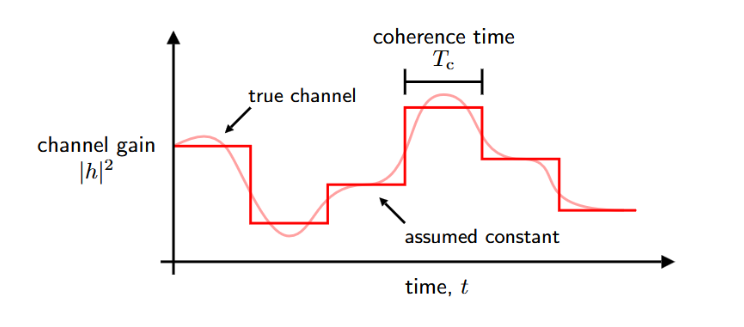

**AWGN Capacity:** C(SNR) = $\log_2(1 + \text{SNR})$ 

If we assume a Narrowband fading model:

$$ 
y = \sqrt{G}hx + v, \quad v \sim \mathcal{N}_\mathcal{C}(0, N_0), 
$$
where:
- $G$ captures the large-scale gain of the channel (e.g. path loss, shadowing)
- $h$ captures small-scale fading of the propagation channel (e.g. Rayleigh Fading)
- $v$ is the additive noise at the receiver

For the signal model, $y$, we defined the average SNR to be:
$$
\text{SNR} = \frac{GP_{tx}}{N_0B} = \frac{GE_s}{N_0}
$$
For small-scale fading realization, $h$, we can define the **Instantaneous SNR** to be: 
$$
\gamma = \frac{GP_{tx} * |h|^2}{N_0B} = \text{SNR} * |h|^2
$$

To model changes in $|h|^2$ and $\gamma$ over time, we use the **Block Fading Model**

#### Block Fading Model
The block fading model assumes the channel remains constant for $T_c$ seconds before abruptly changing. We refer to $T_c$ as the **coherence time** of the channel which is the time frame for which the channel is approximately not changing.

#### Ergodic vs Quasi-Static
**Ergodic Fading Conditions**: represents when each codeword may be exposed to many channel realizations. We can say the channel exhibits fast fading relative to the transmitted symbols, $T_c \ll T$

**Quasi-Static**: represents the setting when each codeword is exposed to an essentially constant channel. We can say the channel exhibits slow-fading relative to the transmitted symbols, $T_c \gg T$

#### Fading Capacity
Definition: The maximum long-term rate of reliable communication

For a given channel realization, $h$, the maximum spectral efficiency is:
$$\log_2(1 + \text{SNR} * |h|^2)$$

**CSIR**: channel state information at only the receiver
**CSIT**: channel state information at both TX and RX

#### For Slow-Fading (Quasi-Static) Channels:
If CSIR only:
- The channel capacity is dictated by the amount of outage we want to tolerate, $\epsilon$. 
$$ C_\epsilon(\text{SNR}) = \log_2(1 + \text{SNR} * F^{-1}_{|h|^2}(\epsilon))$$
- We call this the **Outage Capacity** where $F^{-1}_{|h|^2}$ is the CDF of $|h|^2$ returning the value $X$ such that $P[|h|^2 < X] = \epsilon$ 

If CSIT:
- We can use adaptive modulation where the TX adjusts the modulation and coding scheme to prevent outages. The channel capacity can be modeled by:
$$C(SNR) = \mathbb{E}[\log_2(1 + \text{SNR}*|h|^2)]$$
#### For Fast-Fading (Ergodic) Channels:
If CSIR only:
- The TX must fix its rate based on long-term channel statistics
- In this case, the maximum rate can be modeled by:
$$C(\text{SNR}) = \mathbb{E}[\log_2(1 + \text{SNR}*|h|^2)]$$
- This is referred to as the **Ergodic Capacity**

If CSIT:
- If we are under a **Per-Symbol Power Constraint**, then the capacity is achieved by transmitting each symbol at full power:
$$C(SNR) = \mathbb{E}[\log_2(1 + \text{SNR}*|h|^2)]$$
- If we are under a **Per-Codeword Power Constraint**, then we treat it as a water-filling problem where we give more power to strong channels and less power to weak channels (waterfilling)
$$C(SNR) = \mathbb{E}[\log_2(1 + \text{SNR}*|h|^2 * P(|h|^2))]$$
